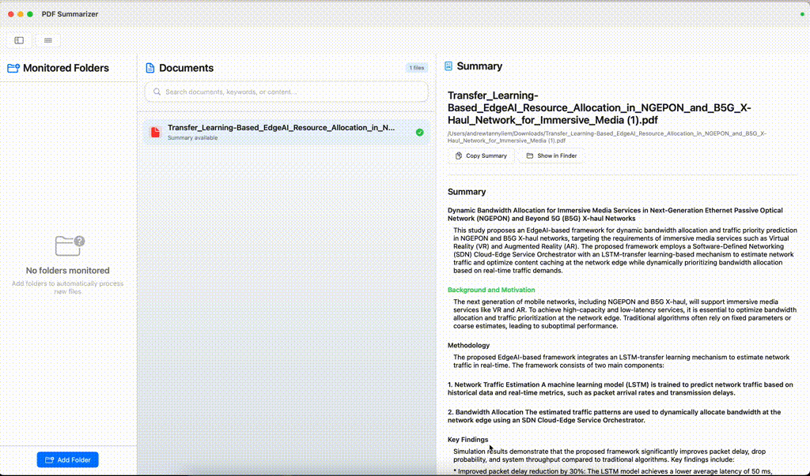

# PDF Summarizer

A powerful macOS application that automatically processes PDF documents and images to generate intelligent summaries using AI. Built with SwiftUI and SwiftData for a native macOS experience.

## Demo



## Features

### 🤖 AI-Powered Summarization
- **Dual AI Support**: Choose between OpenAI GPT models or local Ollama models
- **Smart Processing**: Automatic OCR for images and text extraction from PDFs
- **Customizable Prompts**: Tailor the summarization to your specific needs
- **Keyword Extraction**: Automatically generates relevant keywords for each document

### 📁 Intelligent File Management
- **Folder Monitoring**: Automatically processes new files added to monitored folders
- **Persistent Storage**: All summaries and settings saved using SwiftData
- **File Type Support**: PDFs, PNG, JPG, JPEG, and TIFF files
- **Batch Processing**: Handle multiple documents simultaneously

### 🔍 Advanced Search
- **Multi-faceted Search**: Search across filenames, keywords, and summary content
- **Real-time Filtering**: Instant results as you type
- **Search Highlighting**: Visual highlighting of search terms in results
- **Smart Results**: Shows match count and context

### 💻 Native macOS Experience
- **Modern UI**: Clean, responsive interface following macOS design patterns
- **Collapsible Sidebar**: Hide/show monitored folders panel for more space
- **Quick Actions**: Copy summaries, open OCR text files, show in Finder
- **Keyboard Shortcuts**: Efficient navigation and actions
- **Toast Notifications**: Subtle feedback for user actions

## Installation

### Prerequisites
- macOS 14.0 or later
- Xcode 15.0 or later (for building from source)
- An OpenAI API key OR Ollama installed locally

### Building from Source
1. Clone the repository:
   ```bash
   git clone https://github.com/yourusername/PDFsum.git
   cd PDFsum
   ```

2. Open the project in Xcode:
   ```bash
   open PDFsum.xcodeproj
   ```

3. Build and run the project (⌘+R)

### Setting up AI Services

#### Option 1: OpenAI (Recommended)
1. Get an API key from [OpenAI](https://platform.openai.com/api-keys)
2. Open PDF Summarizer → Settings
3. Enter your OpenAI API key
4. Select your preferred GPT model (GPT-4 recommended)

#### Option 2: Ollama (Local)
1. Install [Ollama](https://ollama.ai/)
2. Pull a compatible model:
   ```bash
   ollama pull llama2
   # or
   ollama pull llava  # for vision processing
   ```
3. Open PDF Summarizer → Settings
4. Toggle "Use Ollama" and configure the API URL (default: http://localhost:11434/api/chat)

## Usage

### Getting Started
1. **Add Monitored Folders**: Click "Add Folder" to select directories to monitor
2. **Configure Settings**: Set up your AI service and customize prompts
3. **Process Documents**: Drop files into monitored folders or they'll be processed automatically

### Interface Overview
- **Top Bar**: Toggle sidebar, access menu, view app status
- **Sidebar**: Manage monitored folders (collapsible)
- **Documents Panel**: View and search processed files
- **Summary Panel**: Read detailed summaries with quick actions

### Key Features
- **Search**: Use the search bar to find documents by name, keywords, or content
- **Quick Actions**: 
  - Copy summary to clipboard
  - Open OCR text file
  - Show document in Finder
- **Delete Documents**: Hover over documents to reveal delete button
- **Sidebar Toggle**: Click the sidebar icon to maximize reading space

## Technical Details

### Architecture
- **SwiftUI**: Modern declarative UI framework
- **SwiftData**: Core Data successor for persistent storage
- **Combine**: Reactive programming for data flow
- **Vision Framework**: OCR text extraction from images
- **PDFKit**: PDF text extraction and processing

### File Structure
```
PDFsum/
├── PDFsum/
│   ├── ContentView.swift          # Main UI and logic
│   ├── SettingsView.swift         # Settings configuration
│   ├── DataModels.swift           # SwiftData models
│   ├── DesignSystem.swift         # UI components and styling
│   ├── Services/
│   │   ├── OpenAIService.swift    # OpenAI API integration
│   │   ├── OllamaService.swift    # Ollama API integration
│   │   └── SummarizationService.swift # AI service coordinator
│   ├── Processing/
│   │   ├── ContentProcessor.swift # File processing logic
│   │   └── SummaryParser.swift    # Summary formatting
│   └── Utilities/
│       ├── DirectoryMonitor.swift # File system monitoring
│       └── CommonModels.swift     # Shared data structures
├── Assets.xcassets/               # App icons and assets
└── PDFsum.entitlements           # App permissions
```

### Data Models
- **PersistentContentSummary**: Stores document summaries and metadata
- **AppSettings**: User preferences and configuration
- **ContentSummary**: Runtime document representation

### Security & Privacy
- **Sandboxed**: App runs in macOS sandbox for security
- **Local Processing**: OCR and file processing happen locally
- **API Security**: API keys stored securely in app settings
- **File Access**: Uses security-scoped bookmarks for file access

## Configuration

### Settings Options
- **AI Service**: Choose between OpenAI or Ollama
- **API Configuration**: Set API keys and endpoints
- **Model Selection**: Choose specific AI models
- **Processing Mode**: OCR vs. direct vision processing (Ollama)
- **Custom Prompts**: Personalize summarization instructions
- **OCR Language**: Set language for text recognition

### Customization
- **Prompt Templates**: Modify the AI prompts for different use cases
- **Keyword Count**: Adjust number of keywords extracted
- **File Filters**: Configure supported file types
- **UI Themes**: Built-in light/dark mode support

## Troubleshooting

### Common Issues
1. **Files not processing**: Check folder permissions and file formats
2. **API errors**: Verify API keys and internet connection
3. **OCR quality**: Ensure images are clear and high-resolution
4. **Ollama connection**: Verify Ollama is running and accessible

### Debug Mode
Enable detailed logging by checking console output for emoji-prefixed messages:
- 📂 File operations
- 🤖 AI processing
- 📊 Data storage
- ❌ Errors

## Contributing

1. Fork the repository
2. Create a feature branch (`git checkout -b feature/amazing-feature`)
3. Commit your changes (`git commit -m 'Add amazing feature'`)
4. Push to the branch (`git push origin feature/amazing-feature`)
5. Open a Pull Request

### Development Setup
1. Install Xcode 15.0+
2. Clone the repo and open in Xcode
3. Build and run for testing
4. Follow Swift style guidelines

## License

This project is licensed under the MIT License - see the [LICENSE](LICENSE) file for details.

## Acknowledgments

- **OpenAI** for GPT models
- **Ollama** for local AI inference
- **Apple** for SwiftUI, SwiftData, and Vision frameworks
- **Community** for feedback and contributions

## Roadmap

- [ ] Batch export of summaries
- [ ] Custom summary templates
- [ ] Integration with note-taking apps
- [ ] Advanced file organization
- [ ] Cloud sync capabilities
- [ ] iOS companion app

---

**Made with ❤️ for macOS**

For support or questions, please [open an issue](https://github.com/yourusername/PDFsum/issues). 